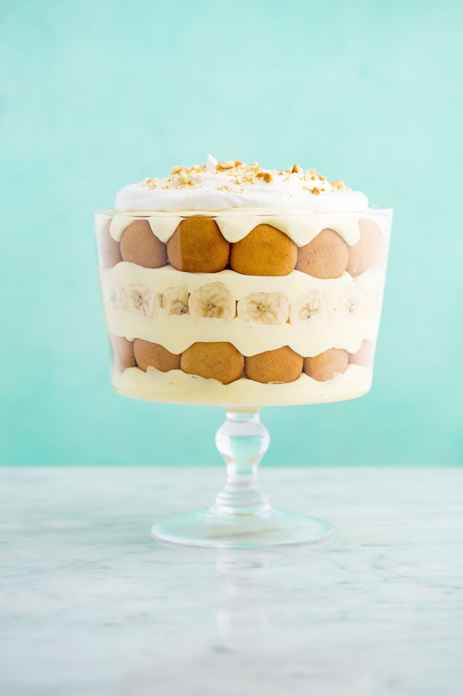

# Perfect Banana Pudding

Banana pudding is one of our all-time favorite desserts. It's a classic Southern recipe, and for good reason; luscious layers of pudding, whipped cream, ripe bananas, and wafer cookies are completely impossible to resist.

# FAQ

## Can I make this in advance?
Absolutely! You can make this pudding up to 48 hours in advance. Any longer and the bananas will begin losing moisture, so it's best to stick to 2 days or less.

## How long does banana pudding keep?
Kept in an airtight container in the fridge, banana pudding will last up to 4 days. The wafer cookies will continue to get more and more soft, so if you're not a fan of soggy cookies, try to finish it sooner!

## Estimated Preperation Time
Yields |Preperation Time | Freeze Time | Total Estimated Time
------ | ----------------|-------------|-----------
10 | 0 hrs. 25 mins. | 3-4 hours or Overnight | 3 hrs. 25 mins.

